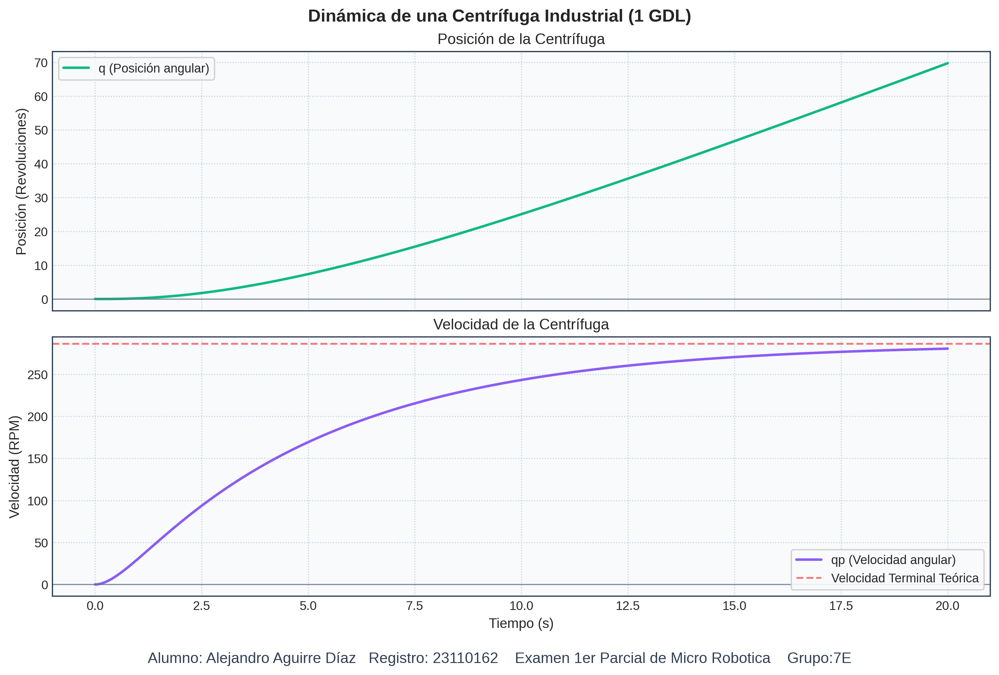
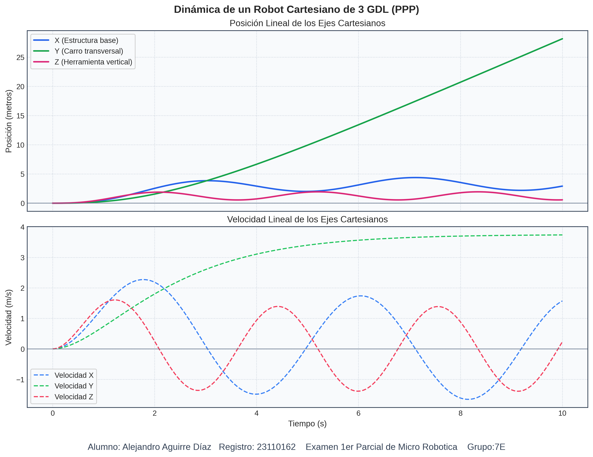
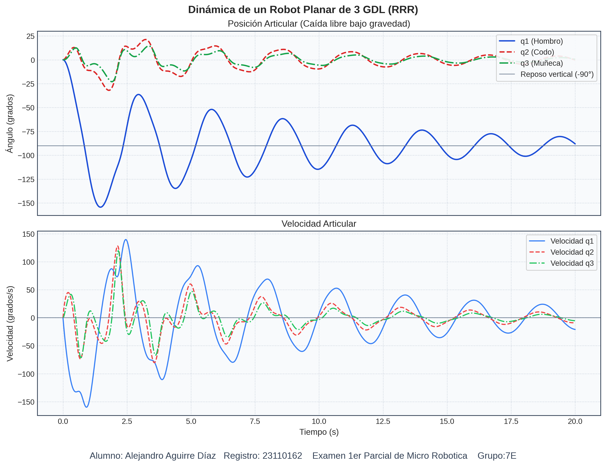

# Examen del Primer Parcial - Modelado Dinamico de Robots

## Datos del estudiante

|  |  |
|---|---|
| Alumno | Alejandro Aguirre Díaz |
| Registro | 23110162 |
| Grupo | 7E |
| Fecha de entrega | Miercoles 18 de marzo de 2026 |

Este directorio del repositorio MicroRobotica contiene los 4 ejercicios del examen del primer parcial. En cada ejercicio se realiza el modelado dinamico y la simulacion numerica en Python para obtener sus graficas de comportamiento.

## Descripcion del examen

Realizar y graficar el modelo dinamico de:

1. Centrifuga industrial (1 GDL)
2. Robot cartesiano PPP (3 GDL)
3. Robot planar RR (2 GDL)
4. Robot planar RRR (3 GDL)

## Estructura del examen

| Ejercicio | Robot | Script | Grafica generada |
|---|---|---|---|
| 1 | Centrifuga (1 GDL) | [Scripts/001_Centrifuga.py](Scripts/001_Centrifuga.py) | [Graficas/G001_Centrifuga.png](Graficas/G001_Centrifuga.png) |
| 2 | Cartesiano PPP (3 GDL) | [Scripts/002_Cartesiano.py](Scripts/002_Cartesiano.py) | [Graficas/G002_Cartesiano.png](Graficas/G002_Cartesiano.png) |
| 3 | Robot RR (2 GDL) | [Scripts/003_RR.py](Scripts/003_RR.py) | [Graficas/G003_RR.png](Graficas/G003_RR.png) |
| 4 | Robot RRR (3 GDL) | [Scripts/004_RRR.py](Scripts/004_RRR.py) | [Graficas/G004_RRR.png](Graficas/G004_RRR.png) |

## Dependencias

Los scripts usan:

- Python 3
- numpy
- scipy
- matplotlib

Instalacion recomendada:

```bash
python3 -m pip install numpy scipy matplotlib
```

## Ejecucion

Desde esta carpeta:

```bash
cd Scripts
python3 001_Centrifuga.py
python3 002_Cartesiano.py
python3 003_RR.py
python3 004_RRR.py
```

Cada script resuelve su sistema con `solve_ivp(..., method='RK45')` y guarda automaticamente su grafica en `../Graficas/`.

---

## Marco matematico comun

La forma general del modelo dinamico en robots se expresa como:

$$
M(q)\,\ddot{q} + C(q,\dot{q})\,\dot{q} + G(q) + F_r(\dot{q}) = \tau
$$

donde:

- $q$: coordenadas generalizadas (angulares o lineales)
- $M(q)$: matriz de inercia
- $C(q,\dot{q})\dot{q}$: efectos de Coriolis/centrifugos
- $G(q)$: terminos de gravedad
- $F_r(\dot{q})$: friccion
- $\tau$: entradas (pares o fuerzas)

Para integrar numericamente, cada modelo se pasa a primer orden con el estado:

$$
x = \begin{bmatrix} q \\ \dot{q} \end{bmatrix},
\qquad
\dot{x} = f(t,x)
$$

---

## Ejercicio 1 - Centrifuga industrial (1 GDL)

Referencia:

- Codigo: [Scripts/001_Centrifuga.py](Scripts/001_Centrifuga.py)
- Grafica: [Graficas/G001_Centrifuga.png](Graficas/G001_Centrifuga.png)

### Variables y parametros

- Coordenada: $q$ (angulo)
- Velocidad: $\dot{q}$
- Masa: $m = 10\,kg$
- Radio: $r = 0.5\,m$
- Inercia: $I = mr^2 = 2.5\,kg\,m^2$
- Friccion viscosa: $b = 0.5$
- Par aplicado:

$$
tau(t) = 15\,(1-e^{-2t})\,\text{N m}
$$

### Ecuacion dinamica

$$
I\ddot{q} + b\dot{q} = \tau(t)
$$

Despejando aceleracion:

$$
\ddot{q} = \frac{\tau(t)-b\dot{q}}{I}
$$

### Forma de estado

Con $x_1=q$, $x_2=\dot{q}$:

$$
\dot{x}_1 = x_2
$$

$$
\dot{x}_2 = \frac{15(1-e^{-2t}) - 0.5x_2}{2.5}
$$

### Desarrollo matematico base para la centrifuga

Esta seccion presenta la derivacion fisica que lleva al modelo dinamico implementado en el script de Python.

En esta derivacion se usa la notacion:

- $qp = dq/dt$
- $qpp = d^2q/dt^2$

#### 1. Cinematica diferencial (calculo de $v^2$)

El objetivo es obtener la rapidez al cuadrado de la masa en rotacion, porque la energia cinetica traslacional usa $K = (1/2)mv^2$.

Posicion de una masa puntual a radio $r$:

$$
x = r sin(q)
$$

$$
y = -r cos(q)
$$

Derivadas temporales:

$$
xp = r cos(q) qp
$$

$$
yp = r sin(q) qp
$$

Rapidez al cuadrado:

$$
v^2 = xp^2 + yp^2
$$

$$
v^2 = r^2 cos^2(q) qp^2 + r^2 sin^2(q) qp^2
$$

Factorizando y usando $sin^2(theta)+cos^2(theta)=1$:

$$
v^2 = r^2 qp^2
$$

#### 2. Formulacion de energias

Energia cinetica de la masa en rotacion:

$$
K = (1/2) m v^2 = (1/2) m r^2 qp^2
$$

Definiendo la inercia equivalente:

$$
I = m r^2
$$

queda:

$$
K = (1/2) I qp^2
$$

Para este modelo, la energia potencial se toma constante (o nula de referencia), por lo que:

$$
U = 0
$$

Lagrangiano:

$$
L = K - U = (1/2) I qp^2
$$

#### 3. Euler-Lagrange con friccion viscosa

Ecuacion de Euler-Lagrange con par externo y torque disipativo:

$$
d/dt[dL/dqp] - dL/dq = tau(t) - tau_f
$$

Modelo de friccion viscosa:

$$
tau_f = b qp
$$

Como $L$ no depende explicitamente de $q$:

$$
dL/dq = 0
$$

y

$$
dL/dqp = I qp
$$

por tanto:

$$
d/dt[dL/dqp] = I qpp
$$

Sustituyendo:

$$
I qpp = tau(t) - b qp
$$

o en forma cerrada:

$$
I qpp + b qp = tau(t)
$$

Con el par aplicado del ejercicio:

$$
tau(t) = 15(1-e^{-2t})
$$

#### 4. Ecuacion final para simulacion

Despejando aceleracion angular:

$$
qpp = (tau(t) - b qp)/I
$$

Con los parametros del script:

$$
m=10, \quad r=0.5, \quad I=mr^2=2.5, \quad b=0.5
$$

se obtiene:

$$
qpp = (15(1-e^{-2t}) - 0.5 qp)/2.5
$$

y en espacio de estado:

$$
x_1p = x_2, \qquad x_2p = (15(1-e^{-2t}) - 0.5x_2)/2.5
$$

#### 5. Empate directo con el programa de Python (base implementada)

Referencia de codigo: [Scripts/001_Centrifuga.py](Scripts/001_Centrifuga.py)

La derivacion anterior se refleja en el script asi:

1. Parametros fisicos: `m`, `r`, `I = m * r**2` y `b`.
2. Par de entrada: `tau = 15.0 * (1 - np.exp(-2.0 * t))`.
3. Dinamica escalar: `qpp = (tau - b * qp) / I`.
4. Forma de estado para el integrador: retorno `return [qp, qpp]`.
5. Integracion numerica: `solve_ivp(modelo_centrifuga, ...)`.

Con esto, el desarrollo energetico y de Euler-Lagrange queda directamente referenciado en la implementacion numerica del programa.

### Simulacion

- Condicion inicial: $[q(0),\dot{q}(0)] = [0,0]$
- Tiempo: $0\,s$ a $20\,s$
- Salidas graficadas: posicion (vueltas) y velocidad (RPM)

### Grafica del ejercicio



### Observaciones principales

- La posicion angular crece de forma monotona, indicando giro continuo sin invertir sentido.
- La velocidad en RPM sube rapidamente durante el transitorio y luego se acerca a un valor de equilibrio.
- La linea teorica de velocidad terminal coincide con el comportamiento esperado por el balance entre par aplicado y friccion viscosa.

Velocidad terminal teorica (linea punteada en la figura):

$$
\omega_{\infty} = \frac{\tau_{max}}{b} = \frac{15}{0.5} = 30\,rad/s
$$

$$
RPM_{\infty} = 30\frac{60}{2\pi} \approx 286.48\,RPM
$$

---

## Ejercicio 2 - Robot cartesiano PPP (3 GDL)

Referencia:

- Codigo: [Scripts/002_Cartesiano.py](Scripts/002_Cartesiano.py)
- Grafica: [Graficas/G002_Cartesiano.png](Graficas/G002_Cartesiano.png)

### Variables y parametros

- Coordenadas lineales: $q = [x, y, z]^T$
- Velocidades: $\dot{q} = [\dot{x}, \dot{y}, \dot{z}]^T$
- Masas equivalentes:

$$
M_x = 150, \quad M_y = 60, \quad M_z = 15\,kg
$$

- Friccion viscosa:

$$
b_x=80, \quad b_y=40, \quad b_z=20
$$

- Entradas:

$$
F_x(t) = 400\sin(1.5t)
$$

$$
F_y(t) = 150(1-e^{-t})
$$

$$
F_z(t) = M_zg + 50\sin(2t)
$$

### Ecuaciones dinamicas

$$
M_x\ddot{x} + b_x\dot{x} = F_x(t)
$$

$$
M_y\ddot{y} + b_y\dot{y} = F_y(t)
$$

$$
M_z\ddot{z} + b_z\dot{z} + M_zg = F_z(t)
$$

En el codigo, el eje $z$ resta explicitamente la gravedad:

$$
\ddot{z} = \frac{F_z - M_zg - b_z\dot{z}}{M_z}
$$

### Forma de estado

Con $x_e=[x,y,z,\dot{x},\dot{y},\dot{z}]^T$:

$$
\dot{x}_e = [\dot{x},\dot{y},\dot{z},\ddot{x},\ddot{y},\ddot{z}]^T
$$

### Desarrollo matematico base para el robot cartesiano

Esta seccion presenta la derivacion que sirve de base al modelo dinamico implementado para el robot cartesiano PPP.

En esta derivacion se usa la notacion:

- $xp = dx/dt$, $xpp = d^2x/dt^2$
- $yp = dy/dt$, $ypp = d^2y/dt^2$
- $zp = dz/dt$, $zpp = d^2z/dt^2$

#### 1. Cinematica diferencial (calculo de $v_x^2$, $v_y^2$, $v_z^2$)

Como cada articulacion es prismatica, las coordenadas generalizadas son desplazamientos lineales:

$$
q = [x, y, z]^T
$$

La rapidez en cada eje se obtiene por derivacion directa:

$$
v_x^2 = xp^2, \qquad v_y^2 = yp^2, \qquad v_z^2 = zp^2
$$

Si se considera la rapidez cartesiana total del efector:

$$
v^2 = xp^2 + yp^2 + zp^2
$$

#### 2. Formulacion de energias

La energia cinetica total (modelo desacoplado por eje) es:

$$
K = (1/2)M_x xp^2 + (1/2)M_y yp^2 + (1/2)M_z zp^2
$$

La energia potencial gravitacional solo depende del eje vertical $z$:

$$
U = M_z g z
$$

Lagrangiano:

$$
L = K - U
$$

#### 3. Euler-Lagrange por eje (con fuerzas no conservativas)

Para cada coordenada generalizada $q_i$:

$$
d/dt[dL/dq_{ip}] - dL/dq_i = Q_i
$$

donde $Q_i$ incluye fuerza del actuador menos friccion viscosa en cada eje.

##### Eje X

$$
dL/dxp = M_x xp, \qquad d/dt[dL/dxp] = M_x xpp, \qquad dL/dx = 0
$$

Con $Q_x = F_x - b_x xp$:

$$
M_x xpp = F_x - b_x xp
$$

$$
xpp = (F_x - b_x xp)/M_x
$$

##### Eje Y

$$
dL/dyp = M_y yp, \qquad d/dt[dL/dyp] = M_y ypp, \qquad dL/dy = 0
$$

Con $Q_y = F_y - b_y yp$:

$$
M_y ypp = F_y - b_y yp
$$

$$
ypp = (F_y - b_y yp)/M_y
$$

##### Eje Z

$$
dL/dzp = M_z zp, \qquad d/dt[dL/dzp] = M_z zpp, \qquad dL/dz = -M_z g
$$

Con $Q_z = F_z - b_z zp$:

$$
M_z zpp + M_z g = F_z - b_z zp
$$

$$
M_z zpp = F_z - M_z g - b_z zp
$$

$$
zpp = (F_z - M_z g - b_z zp)/M_z
$$

#### 4. Ensamblaje matricial

Definiendo:

$$
q = [x,y,z]^T, \qquad qp = [xp,yp,zp]^T, \qquad qpp = [xpp,ypp,zpp]^T
$$

$$
M =
\begin{bmatrix}
M_x & 0 & 0 \\
0 & M_y & 0 \\
0 & 0 & M_z
\end{bmatrix}
$$

$$
B =
\begin{bmatrix}
b_x & 0 & 0 \\
0 & b_y & 0 \\
0 & 0 & b_z
\end{bmatrix}
$$

$$
g_v = [0,0,M_z g]^T, \qquad F = [F_x, F_y, F_z]^T
$$

La ecuacion dinamica compacta queda:

$$
M qpp + B qp + g_v = F
$$

o equivalentemente:

$$
qpp = M^{-1}(F - B qp - g_v)
$$

#### 5. Ecuacion cerrada con las entradas del ejercicio

Usando las entradas definidas en la simulacion:

$$
F_x(t) = 400 sin(1.5t)
$$

$$
F_y(t) = 150(1-e^{-t})
$$

$$
F_z(t) = M_z g + 50 sin(2t)
$$

se obtiene:

$$
xpp = (400 sin(1.5t) - b_x xp)/M_x
$$

$$
ypp = (150(1-e^{-t}) - b_y yp)/M_y
$$

$$
zpp = (50 sin(2t) - b_z zp)/M_z
$$

La ultima expresion aparece porque $F_z$ ya incluye compensacion exacta de gravedad ($M_z g$).

#### 6. Empate directo con el programa de Python (base implementada)

Referencia de codigo: [Scripts/002_Cartesiano.py](Scripts/002_Cartesiano.py)

El desarrollo anterior se refleja en el script asi:

1. Parametros del modelo: `Mx`, `My`, `Mz`, `bx`, `by`, `bz`, y `g`.
2. Fuerzas de actuacion: `Fx`, `Fy` y `Fz`.
3. Ecuaciones por eje: `xpp = (Fx - bx * xp) / Mx`, `ypp = (Fy - by * yp) / My`, `zpp = (Fz - Mz * g - bz * zp) / Mz`.
4. Forma de estado para el integrador: retorno `return [xp, yp, zp, xpp, ypp, zpp]`.
5. Integracion numerica: `solve_ivp(robot_cartesiano, ...)`.

Con esto, la formulacion por Euler-Lagrange (con fuerzas generalizadas y friccion viscosa) queda directamente conectada con la implementacion numerica del modelo.

### Simulacion

- Condicion inicial: reposo en el origen
- Tiempo: $0\,s$ a $10\,s$
- Salidas: posicion y velocidad de los tres ejes

### Grafica del ejercicio



### Observaciones principales

- El eje X muestra oscilaciones alrededor del origen por la fuerza sinusoidal aplicada y la amortiguacion viscosa.
- El eje Y presenta una respuesta de crecimiento transitorio y estabilizacion progresiva, consistente con una excitacion que se activa suavemente.
- El eje Z oscila en torno a una condicion de equilibrio vertical, ya que la gravedad esta compensada y solo queda la componente sinusoidal adicional.

---

## Ejercicio 3 - Robot RR (2 GDL)

Referencia:

- Codigo: [Scripts/003_RR.py](Scripts/003_RR.py)
- Grafica: [Graficas/G003_RR.png](Graficas/G003_RR.png)

### Variables de estado

$$
q = [q_1, q_2]^T, \qquad \dot{q} = [\dot{q}_1, \dot{q}_2]^T
$$

### Modelo dinamico implementado

$$
M(q)\ddot{q} + C(q,\dot{q})\dot{q} + g(q) + f_r(\dot{q}) = \tau(t)
$$

con:

$$
M(q)=
\begin{bmatrix}
3.117 + 0.2\cos(q_2) & 0.108 + 0.1\cos(q_2) \\
0.108 + 0.1\cos(q_2) & 0.108
\end{bmatrix}
$$

$$
C(q,\dot{q})=
\begin{bmatrix}
-0.2\sin(q_2)\dot{q}_2 & -0.1\sin(q_2)\dot{q}_2 \\
0.1\sin(q_2)\dot{q}_1 & 0
\end{bmatrix}
$$

$$
g(q)=
\begin{bmatrix}
39.3\sin(q_1)+1.95\sin(q_1+q_2) \\
1.95\sin(q_1+q_2)
\end{bmatrix}
$$

$$
f_r(\dot{q})=
\begin{bmatrix}
1.86\dot{q}_1 + 1.93\tanh(10^5\dot{q}_1) \\
0.16\dot{q}_2 + 0.3\tanh(10^5\dot{q}_2)
\end{bmatrix}
$$

Los pares de entrada son excitaciones mixtas (rampa exponencial + senoidales):

$$
tau_1(t) = (1-e^{-0.8t})32 + 56\sin(16t+0.1) + 12\sin(20t+0.15)
$$

$$
tau_2(t) = (1-e^{-1.8t})1.2 + 8\sin(26t+0.08) + 2\sin(12t+0.34)
$$

En simulacion se calcula:

$$
\ddot{q} = M^{-1}\left(\tau - C\dot{q} - g - f_r\right)
$$

(implementado con `np.linalg.solve(M, ...)` para mayor estabilidad numerica).

### Desarrollo matematico base para el robot RR

Esta seccion documenta la base teorica que conduce al modelo dinamico implementado en el programa de Python.

En esta derivacion se usa la notacion:

- $q_1p = dq_1/dt$, $q_2p = dq_2/dt$
- $q_1pp = d^2q_1/dt^2$, $q_2pp = d^2q_2/dt^2$

#### 1. Cinematica diferencial (calculo de $v_1^2$ y $v_2^2$)

El objetivo es obtener la rapidez al cuadrado de cada eslabon, porque la energia cinetica traslacional usa $K = (1/2)mv^2$.

##### Eslabon 1

Posicion:

$$
x_1 = l_{c1} sin(q_1)
$$

$$
y_1 = -l_{c1} cos(q_1)
$$

Derivadas temporales:

$$
x_1p = l_{c1} cos(q_1) q_1p
$$

$$
y_1p = l_{c1} sin(q_1) q_1p
$$

Rapidez al cuadrado:

$$
v_1^2 = x_1p^2 + y_1p^2
$$

$$
v_1^2 = l_{c1}^2 cos^2(q_1) q_1p^2 + l_{c1}^2 sin^2(q_1) q_1p^2
$$

Factorizando y usando $sin^2(theta) + cos^2(theta) = 1$:

$$
v_1^2 = l_{c1}^2 q_1p^2
$$

##### Eslabon 2 (desarrollo algebraico completo)

Posicion:

$$
x_2 = l_1 sin(q_1) + l_{c2} sin(q_1 + q_2)
$$

$$
y_2 = -l_1 cos(q_1) - l_{c2} cos(q_1 + q_2)
$$

Derivadas temporales (regla de la cadena):

$$
x_2p = l_1 cos(q_1) q_1p + l_{c2} cos(q_1 + q_2)(q_1p + q_2p)
$$

$$
y_2p = l_1 sin(q_1) q_1p + l_{c2} sin(q_1 + q_2)(q_1p + q_2p)
$$

Elevando al cuadrado:

$$
x_2p^2 = l_1^2 cos^2(q_1) q_1p^2 + l_{c2}^2 cos^2(q_1 + q_2)(q_1p + q_2p)^2
$$

$$
+ 2 l_1 l_{c2} cos(q_1) cos(q_1 + q_2) q_1p (q_1p + q_2p)
$$

$$
y_2p^2 = l_1^2 sin^2(q_1) q_1p^2 + l_{c2}^2 sin^2(q_1 + q_2)(q_1p + q_2p)^2
$$

$$
+ 2 l_1 l_{c2} sin(q_1) sin(q_1 + q_2) q_1p (q_1p + q_2p)
$$

Sumando $x_2p^2 + y_2p^2$:

$$
v_2^2 = l_1^2 q_1p^2 [cos^2(q_1)+sin^2(q_1)]
$$

$$
+ l_{c2}^2 (q_1p + q_2p)^2 [cos^2(q_1+q_2)+sin^2(q_1+q_2)]
$$

$$
+ 2 l_1 l_{c2} q_1p (q_1p + q_2p) [cos(q_1)cos(q_1+q_2)+sin(q_1)sin(q_1+q_2)]
$$

Los dos primeros corchetes valen 1 y, para el tercero:

$$
cos(A)cos(B) + sin(A)sin(B) = cos(A-B)
$$

$$
cos(q_1)cos(q_1+q_2)+sin(q_1)sin(q_1+q_2)=cos(-q_2)=cos(q_2)
$$

Entonces:

$$
v_2^2 = l_1^2 q_1p^2 + l_{c2}^2 (q_1p + q_2p)^2 + 2 l_1 l_{c2} cos(q_2) q_1p (q_1p + q_2p)
$$

#### 2. Formulacion de energias

Energia cinetica total (traslacion + rotacion):

$$
K = ((1/2)m_1 v_1^2 + (1/2)I_1 q_1p^2) + ((1/2)m_2 v_2^2 + (1/2)I_2 (q_1p + q_2p)^2)
$$

Sustituyendo $v_1^2$ y $v_2^2$:

$$
K = (1/2)(m_1 l_{c1}^2 + I_1) q_1p^2
$$

$$
+ (1/2)m_2 [l_1^2 q_1p^2 + l_{c2}^2 (q_1p + q_2p)^2 + 2 l_1 l_{c2} cos(q_2) q_1p (q_1p + q_2p)]
$$

$$
+ (1/2)I_2 (q_1p + q_2p)^2
$$

Energia potencial total:

$$
U = m_1 g y_1 + m_2 g y_2
$$

$$
U = m_1 g[-l_{c1} cos(q_1)] + m_2 g[-l_1 cos(q_1) - l_{c2} cos(q_1 + q_2)]
$$

Lagrangiano:

$$
L = K - U
$$

#### 3. Derivadas de Euler-Lagrange (nucleo del modelo)

Para la articulacion $k$:

$$
d/dt[dL/dq_kp] - dL/dq_k = tau_k
$$

Se evalua primero para el hombro ($k=1$).

##### Paso 3.1: $dL/dq_1p$

Como $U$ no depende de velocidades:

$$
dL/dq_1p = (m_1 l_{c1}^2 + I_1)q_1p + m_2 l_1^2 q_1p
$$

$$
+ m_2 l_{c2}^2 (q_1p + q_2p) + m_2 l_1 l_{c2} cos(q_2)(2q_1p + q_2p)
$$

$$
+ I_2 (q_1p + q_2p)
$$

Agrupando terminos:

$$
dL/dq_1p = M_{11}(q) q_1p + M_{12}(q) q_2p
$$

con:

$$
M_{11} = m_1 l_{c1}^2 + I_1 + m_2 l_1^2 + m_2 l_{c2}^2 + I_2 + 2 m_2 l_1 l_{c2} cos(q_2)
$$

$$
M_{12} = m_2 l_{c2}^2 + I_2 + m_2 l_1 l_{c2} cos(q_2)
$$

##### Paso 3.2: $d/dt[dL/dq_1p]$

Usando regla del producto y:

$$
d/dt[cos(q_2)] = -sin(q_2) q_2p
$$

se obtiene:

$$
d/dt[dL/dq_1p] = M_{11} q_1pp + M_{12} q_2pp
$$

$$
- 2 m_2 l_1 l_{c2} sin(q_2) q_1p q_2p - m_2 l_1 l_{c2} sin(q_2) q_2p^2
$$

Los dos ultimos terminos corresponden a Coriolis y centrifugos.

##### Paso 3.3: $dL/dq_1$

$K$ no depende de $q_1$, por lo que:

$$
dL/dq_1 = -dU/dq_1
$$

$$
dL/dq_1 = -m_1 g l_{c1} sin(q_1) - m_2 g l_1 sin(q_1) - m_2 g l_{c2} sin(q_1 + q_2)
$$

Este termino corresponde al vector de gravedad en la articulacion 1.

#### 4. Ensamblaje matricial

Repitiendo el mismo procedimiento para $q_2$, la dinamica completa queda:

$$
M(q)qpp + C(q,qp)qp + g(q) = tau
$$

De los desarrollos anteriores (primera fila):

$$
m_{11} = m_1 l_{c1}^2 + m_2(l_1^2 + l_{c2}^2 + 2 l_1 l_{c2} cos(q_2)) + I_1 + I_2
$$

$$
m_{12} = m_2(l_{c2}^2 + l_1 l_{c2} cos(q_2)) + I_2
$$

Terminos de Coriolis y centrifugos (primera fila):

$$
c_{11} = -2 m_2 l_1 l_{c2} sin(q_2) q_2p
$$

$$
c_{12} = -m_2 l_1 l_{c2} sin(q_2) q_2p
$$

Termino gravitacional (primera fila):

$$
g_1(q) = -(m_1 l_{c1} + m_2 l_1) g sin(q_1) - m_2 l_{c2} g sin(q_1 + q_2)
$$

El mismo rigor se aplica a la articulacion 2 para completar la segunda fila de $M(q)$, $C(q,qp)$ y $g(q)$.

#### 5. Modelo de friccion y ecuacion cerrada (2 GDL)

Para cerrar la ecuacion dinamica, se agrega friccion viscosa y friccion seca (Coulomb) por articulacion.

Modelo vectorial:

$$
f_f(qp) = Bqp + F_c sgn(qp)
$$

con:

$$
B = [[b_1,0],[0,b_2]], \quad F_c = [[f_{c1},0],[0,f_{c2}]]
$$

y:

$$
sgn(qp) = [sgn(q_1p), sgn(q_2p)]^T
$$

En forma explicita por articulacion:

$$
f_{f1} = b_1 q_1p + f_{c1} sgn(q_1p)
$$

$$
f_{f2} = b_2 q_2p + f_{c2} sgn(q_2p)
$$

Entonces, la ecuacion dinamica cerrada del manipulador 2 GDL queda:

$$
M(q)qpp + C(q,qp)qp + g(q) + f_f(qp) = tau
$$

o equivalentemente:

$$
tau = M(q)qpp + C(q,qp)qp + g(q) + f_f(qp)
$$

Para simulacion numerica puede usarse una aproximacion suave de la funcion signo:

$$
sgn(q_ip) approx tanh(k q_ip), \quad k >> 1
$$

esto evita discontinuidades fuertes en el integrador.

### Empate directo con el programa de Python (base implementada)

Referencia de codigo: [Scripts/003_RR.py](Scripts/003_RR.py)

La estructura teorica anterior se refleja en el script asi:

1. Matriz de inercia $M(q)$: se implementa en el bloque donde se define `M = np.array([...])`.
2. Coriolis y centrifugos: se implementa en `C = np.array([...])` y su accion en el termino `C @ np.array([qp1, qp2])`.
3. Gravedad $g(q)$: se modela en `par_grav = np.array([...])`.
4. Friccion viscosa + Coulomb suavizada: se implementa en `fr = np.array([...])` con `tanh(100000 * qp_i)`.
5. Entrada de pares $tau$: se define en `tau = np.array([...])` como suma de activacion exponencial y terminos senoidales.
6. Ecuacion final resuelta por el integrador: `vector_fuerzas = tau - (C @ np.array([qp1, qp2])) - par_grav - fr` y luego `q2p = np.linalg.solve(M, vector_fuerzas)`.

Con esto, el desarrollo de Lagrange sirve como base conceptual y el script usa su version parametrizada para simulacion numerica estable.

### Simulacion

- Condicion inicial: $[q_1,q_2,\dot{q}_1,\dot{q}_2]=[0,0,0,0]$
- Tiempo: $0\,s$ a $10\,s$
- Salidas: posiciones y velocidades en grados y grados/s

### Grafica del ejercicio


### Observaciones principales

- Las posiciones articulares muestran oscilaciones no lineales con contenido de alta frecuencia debido a la combinacion de entradas sinusoidales.
- Las velocidades presentan picos transitorios y variaciones acopladas entre articulaciones, reflejando la matriz de inercia dependiente de la configuracion.
- La friccion viscosa y Coulomb suavizada limita el crecimiento indefinido de la respuesta y mantiene la simulacion numericamente estable.

---

## Ejercicio 4 - Robot RRR planar (3 GDL)

Referencia:

- Codigo: [Scripts/004_RRR.py](Scripts/004_RRR.py)
- Grafica: [Graficas/G004_RRR.png](Graficas/G004_RRR.png)

### Variables y parametros

$$
q=[q_1,q_2,q_3]^T, \qquad \dot{q}=[\dot{q}_1,\dot{q}_2,\dot{q}_3]^T
$$

$$
m_1=2.0,\ m_2=1.5,\ m_3=1.0\,kg
$$

$$
l_1=1.0,\ l_2=0.8,\ l_3=0.5\,m
$$

$$
g=9.81\,m/s^2
$$

### Modelo dinamico implementado

El script usa la forma:

$$
M(q)\ddot{q} + V(q,\dot{q}) + G(q) + f_r(\dot{q}) = \tau
$$

donde:

- $M(q)$ se arma de forma explicita con terminos $M_{11},\dots,M_{33}$
- $V(q,\dot{q})=[v_1,v_2,v_3]^T$ concentra terminos Coriolis/centrifugos
- $G(q)=[g_1,g_2,g_3]^T$ contiene gravedad
- $f_r=[3\dot{q}_1, 2\dot{q}_2, \dot{q}_3]^T$
- $\tau=[0,0,0]^T$ (caida libre con friccion)

Componentes de gravedad usadas en el codigo:

$$
g_1=(m_1+m_2+m_3)gl_1\cos q_1 + (m_2+m_3)gl_2\cos(q_1+q_2) + m_3gl_3\cos(q_1+q_2+q_3)
$$

$$
g_2=(m_2+m_3)gl_2\cos(q_1+q_2) + m_3gl_3\cos(q_1+q_2+q_3)
$$

$$
g_3=m_3gl_3\cos(q_1+q_2+q_3)
$$

La aceleracion se obtiene resolviendo:

$$
\ddot{q}=M^{-1}(\tau - V - G - f_r)
$$

### Desarrollo matematico base para el robot RRR

Esta seccion presenta la base teorica del manipulador planar RRR usada por el programa del Ejercicio 4.

En esta derivacion se usa la notacion:

- $q = [q_1,q_2,q_3]^T$
- $qp = [q_1p,q_2p,q_3p]^T$
- $qpp = [q_1pp,q_2pp,q_3pp]^T$

#### 1. Cinematica diferencial (calculo de $v_1^2$, $v_2^2$, $v_3^2$)

Se asume modelo planar con masas concentradas al final de cada eslabon, tal como se implementa en el script.

##### Masa 1 (extremo del eslabon 1)

$$
x_1 = l_1 cos(q_1)
$$

$$
y_1 = l_1 sin(q_1)
$$

$$
x_1p = -l_1 sin(q_1) q_1p, \qquad y_1p = l_1 cos(q_1) q_1p
$$

$$
v_1^2 = x_1p^2 + y_1p^2 = l_1^2 q_1p^2
$$

##### Masa 2 (extremo del eslabon 2)

$$
x_2 = l_1 cos(q_1) + l_2 cos(q_1+q_2)
$$

$$
y_2 = l_1 sin(q_1) + l_2 sin(q_1+q_2)
$$

$$
x_2p = -l_1 sin(q_1)q_1p - l_2 sin(q_1+q_2)(q_1p+q_2p)
$$

$$
y_2p = l_1 cos(q_1)q_1p + l_2 cos(q_1+q_2)(q_1p+q_2p)
$$

$$
v_2^2 = l_1^2 q_1p^2 + l_2^2(q_1p+q_2p)^2 + 2 l_1 l_2 cos(q_2) q_1p(q_1p+q_2p)
$$

##### Masa 3 (extremo del eslabon 3)

$$
x_3 = l_1 cos(q_1) + l_2 cos(q_1+q_2) + l_3 cos(q_1+q_2+q_3)
$$

$$
y_3 = l_1 sin(q_1) + l_2 sin(q_1+q_2) + l_3 sin(q_1+q_2+q_3)
$$

Luego de derivar y agrupar terminos:

$$
v_3^2 = l_1^2 q_1p^2 + l_2^2(q_1p+q_2p)^2 + l_3^2(q_1p+q_2p+q_3p)^2
$$

$$
+ 2 l_1 l_2 cos(q_2) q_1p(q_1p+q_2p)
$$

$$
+ 2 l_1 l_3 cos(q_2+q_3) q_1p(q_1p+q_2p+q_3p)
$$

$$
+ 2 l_2 l_3 cos(q_3) (q_1p+q_2p)(q_1p+q_2p+q_3p)
$$

#### 2. Formulacion de energias

Energia cinetica total (traslacional):

$$
K = (1/2)m_1 v_1^2 + (1/2)m_2 v_2^2 + (1/2)m_3 v_3^2
$$

Energia potencial total (gravedad en direccion $-Y$):

$$
U = m_1 g y_1 + m_2 g y_2 + m_3 g y_3
$$

Sustituyendo $y_i$ y agrupando:

$$
U = (m_1+m_2+m_3) g l_1 sin(q_1)
$$

$$
+ (m_2+m_3) g l_2 sin(q_1+q_2)
$$

$$
+ m_3 g l_3 sin(q_1+q_2+q_3)
$$

Lagrangiano:

$$
L = K - U
$$

#### 3. Euler-Lagrange y modelo dinamico

Para cada articulacion $i$:

$$
d/dt[dL/dq_{ip}] - dL/dq_i = tau_i - f_{ri}
$$

Al ensamblar las 3 ecuaciones se obtiene la forma compacta:

$$
M(q)qpp + V(q,qp) + G(q) + f_r(qp) = tau
$$

donde:

- $M(q)$ es la matriz de inercia $3x3$
- $V(q,qp)$ concentra terminos de Coriolis y centrifugos
- $G(q)$ es el vector gravitacional
- $f_r(qp)$ es friccion viscosa articular

#### 4. Correspondencia con las expresiones usadas en el script

Con los parametros del Ejercicio 4, el script implementa explicitamente:

$$
M(q) =
\begin{bmatrix}
M_{11} & M_{12} & M_{13} \\
M_{12} & M_{22} & M_{23} \\
M_{13} & M_{23} & M_{33}
\end{bmatrix}
$$

con:

$$
M_{11}=(m_1+m_2+m_3)l_1^2 + (m_2+m_3)l_2^2 + m_3l_3^2
$$

$$
+ 2(m_2+m_3)l_1l_2 cos(q_2) + 2m_3l_1l_3 cos(q_2+q_3) + 2m_3l_2l_3 cos(q_3)
$$

$$
M_{12}=(m_2+m_3)l_2^2 + m_3l_3^2 + (m_2+m_3)l_1l_2 cos(q_2)
$$

$$
+ m_3l_1l_3 cos(q_2+q_3) + 2m_3l_2l_3 cos(q_3)
$$

$$
M_{13}=m_3l_3^2 + m_3l_1l_3 cos(q_2+q_3) + m_3l_2l_3 cos(q_3)
$$

$$
M_{22}=(m_2+m_3)l_2^2 + m_3l_3^2 + 2m_3l_2l_3 cos(q_3)
$$

$$
M_{23}=m_3l_3^2 + m_3l_2l_3 cos(q_3), \qquad M_{33}=m_3l_3^2
$$

El vector $V(q,qp)$ se implementa como $[v_1,v_2,v_3]^T$ y coincide con los terminos cuadraticos en velocidad obtenidos por Euler-Lagrange.

El vector de gravedad implementado es:

$$
g_1=(m_1+m_2+m_3)gl_1 cos(q_1) + (m_2+m_3)gl_2 cos(q_1+q_2) + m_3gl_3 cos(q_1+q_2+q_3)
$$

$$
g_2=(m_2+m_3)gl_2 cos(q_1+q_2) + m_3gl_3 cos(q_1+q_2+q_3)
$$

$$
g_3=m_3gl_3 cos(q_1+q_2+q_3)
$$

#### 5. Modelo de friccion y ecuacion cerrada

En el script se usa friccion viscosa lineal:

$$
f_r(qp) = [3q_1p,\ 2q_2p,\ q_3p]^T
$$

y para el caso simulado se considera caida libre (sin par motor):

$$
tau = [0,0,0]^T
$$

Por tanto, la dinamica final queda:

$$
M(q)qpp + V(q,qp) + G(q) + f_r(qp) = 0
$$

o equivalentemente:

$$
qpp = M^{-1}(-V - G - f_r)
$$

#### 6. Empate directo con el programa de Python (base implementada)

Referencia de codigo: [Scripts/004_RRR.py](Scripts/004_RRR.py)

El desarrollo teorico anterior se refleja en el script asi:

1. Parametros fisicos: `m1`, `m2`, `m3`, `l1`, `l2`, `l3`, `g`.
2. Matriz de inercia: se construye en `M11...M33` y luego en `M = np.array([...])`.
3. Coriolis y centrifugos: se implementan en `v1`, `v2`, `v3` y `V = np.array([v1, v2, v3])`.
4. Gravedad: se implementa en `g1`, `g2`, `g3` y `G = np.array([g1, g2, g3])`.
5. Friccion viscosa: se implementa en `fr = np.array([3.0 * qp1, 2.0 * qp2, 1.0 * qp3])`.
6. Ecuacion final integrada: `q_dos_puntos = np.linalg.solve(M, tau - V - G - fr)` y retorno en espacio de estado.

Con esto, la derivacion por energia y Euler-Lagrange queda conectada directamente con la implementacion numerica usada para simular el robot RRR.

### Simulacion

- Condicion inicial: robot estirado horizontalmente

$$
[q_1,q_2,q_3,\dot{q}_1,\dot{q}_2,\dot{q}_3] = [0,0,0,0,0,0]
$$

- Tiempo: $0\,s$ a $20\,s$
- Salidas: posiciones y velocidades articulares (grados y grados/s)

### Grafica del ejercicio



### Observaciones principales

- El robot inicia en una posicion de alta energia potencial y evoluciona bajo gravedad hacia configuraciones de menor energia.
- Las velocidades articulares aumentan en el transitorio inicial y luego decrecen por el efecto disipativo de la friccion viscosa.
- Se aprecia fuerte acoplamiento dinamico entre articulaciones: el movimiento de un eslabon modifica la respuesta de los demas durante toda la caida libre.

---

## Interpretacion global de resultados

1. Centrifuga: respuesta transitoria con saturacion de velocidad por equilibrio entre par y friccion.
2. Cartesiano PPP: comportamiento desacoplado por eje con compensacion de gravedad en $z$.
3. RR: dinamica acoplada no lineal con inercia dependiente de configuracion, gravedad y friccion mixta.
4. RRR: caida libre no lineal acoplada con disipacion por friccion viscosa.

Este documento organiza de forma uniforme el desarrollo matematico, la simulacion y la interpretacion de resultados para los cuatro sistemas roboticos solicitados en el examen.


