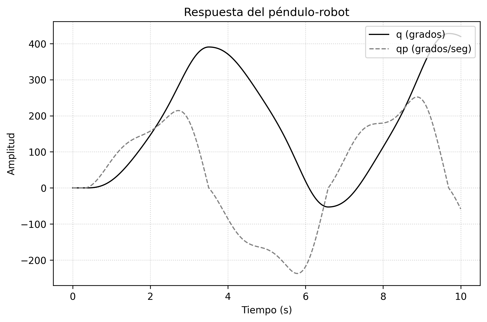
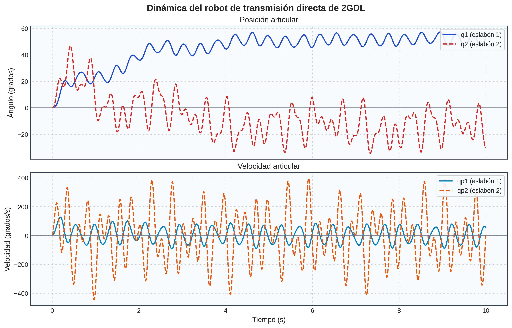

# Metodo paso a paso para obtener el modelo dinamico de un robot-pendulo

## Paso 1: Cinematica Directa (Posicion)

El objetivo es encontrar las coordenadas $(x, y)$ del centro de masa del pendulo en funcion de su angulo articular $q$.

- Geometria: la longitud hasta el centro de masa es $l_c$.
- El angulo $q$ se mide respecto a la vertical.

Usando trigonometria:

$$
x = l_c \sin(q)
$$

$$
y = -l_c \cos(q)
$$

El signo negativo en $y$ aparece porque el eje $y$ positivo apunta hacia arriba, y el pendulo cuelga hacia abajo.

## Paso 2: Cinematica Diferencial (Velocidad lineal)

Para la energia cinetica se necesita $v^2$. La velocidad lineal se obtiene derivando la posicion respecto al tiempo.

Derivadas temporales (regla de la cadena):

$$
\dot{x} = \frac{d}{dt}[l_c\sin(q)] = l_c\cos(q)\dot{q}
$$

$$
\dot{y} = \frac{d}{dt}[-l_c\cos(q)] = l_c\sin(q)\dot{q}
$$

Magnitud de la velocidad al cuadrado:

$$
v^2 = \dot{x}^2 + \dot{y}^2
$$

$$
v^2 = (l_c\cos(q)\dot{q})^2 + (l_c\sin(q)\dot{q})^2
$$

$$
v^2 = l_c^2\dot{q}^2\cos^2(q) + l_c^2\dot{q}^2\sin^2(q)
$$

Factorizando:

$$
v^2 = l_c^2\dot{q}^2(\cos^2(q) + \sin^2(q))
$$

Usando $\cos^2(q) + \sin^2(q) = 1$:

$$
v^2 = l_c^2\dot{q}^2
$$

## Paso 3: Lagrangiano (Balance de energias)

El Lagrangiano se define como:

$$
\mathcal{L} = K - \mathcal{U}
$$

Energia cinetica total (traslacion + rotacion):

$$
K = \frac{1}{2}mv^2 + \frac{1}{2}I\dot{q}^2
$$

Sustituyendo $v^2$:

$$
K = \frac{1}{2}m(l_c^2\dot{q}^2) + \frac{1}{2}I\dot{q}^2
$$

$$
K = \frac{1}{2}[ml_c^2 + I]\dot{q}^2
$$

Energia potencial con referencia en $q = 0$ (posicion mas baja):

$$
h = -l_c\cos(q) - (-l_c) = l_c(1 - \cos(q))
$$

$$
\mathcal{U} = mgl_c[1 - \cos(q)]
$$

Entonces:

$$
\mathcal{L} = \frac{1}{2}[ml_c^2 + I]\dot{q}^2 - mgl_c[1 - \cos(q)]
$$

## Paso 4: Ecuaciones de movimiento de Euler-Lagrange

Para una articulacion:

$$
\frac{d}{dt}\left[\frac{\partial \mathcal{L}}{\partial \dot{q}}\right] - \left[\frac{\partial \mathcal{L}}{\partial q}\right] = \tau - F_{\text{friccion}}
$$

Derivadas necesarias:

$$
\frac{\partial \mathcal{L}}{\partial \dot{q}} = [ml_c^2 + I]\dot{q}
$$

$$
\frac{d}{dt}\left([ml_c^2 + I]\dot{q}\right) = [ml_c^2 + I]\ddot{q}
$$

Expandiendo el termino potencial en $\mathcal{L}$:

$$
\mathcal{L} = \dots - mgl_c + mgl_c\cos(q)
$$

$$
\frac{\partial \mathcal{L}}{\partial q} = -mgl_c\sin(q)
$$

Sustituyendo en Euler-Lagrange:

$$
[ml_c^2 + I]\ddot{q} - (-mgl_c\sin(q)) = \tau - F_{\text{friccion}}
$$

$$
[ml_c^2 + I]\ddot{q} + mgl_c\sin(q) = \tau - F_{\text{friccion}}
$$

Finalmente, incluyendo friccion viscosa y seca:

$$
tau = [ml_c^2 + I]\ddot{q} + mgl_c\sin(q) + b\dot{q} + f_c\operatorname{sgn}(\dot{q})
$$

Esta es la forma del modelo dinamico (ecuacion tipo 5.42) para el sistema robot-pendulo.

---

# Continuacion: Modelo dinamico de un robot de 2 GDL

En esta seccion se desarrolla el algebra y el calculo paso a paso, sin omitir los desarrollos intermedios, usando el metodo de Euler-Lagrange.

## 1. Cinematica diferencial (calculo de $v_1^2$ y $v_2^2$)

El objetivo es obtener la rapidez al cuadrado de cada eslabon, porque la energia cinetica traslacional usa $K = \frac{1}{2}mv^2$.

### Eslabon 1

Posicion:

$$
x_1 = l_{c1}\sin(q_1)
$$

$$
y_1 = -l_{c1}\cos(q_1)
$$

Derivadas temporales:

$$
\dot{x}_1 = l_{c1}\cos(q_1)\dot{q}_1
$$

$$
\dot{y}_1 = l_{c1}\sin(q_1)\dot{q}_1
$$

Rapidez al cuadrado:

$$
v_1^2 = \dot{x}_1^2 + \dot{y}_1^2
$$

$$
v_1^2 = l_{c1}^2\cos^2(q_1)\dot{q}_1^2 + l_{c1}^2\sin^2(q_1)\dot{q}_1^2
$$

Factorizando y usando $\sin^2(\theta)+\cos^2(\theta)=1$:

$$
v_1^2 = l_{c1}^2\dot{q}_1^2
$$

### Eslabon 2 (desarrollo algebraico completo)

Posicion:

$$
x_2 = l_1\sin(q_1) + l_{c2}\sin(q_1+q_2)
$$

$$
y_2 = -l_1\cos(q_1) - l_{c2}\cos(q_1+q_2)
$$

Derivadas temporales (regla de la cadena):

$$
\dot{x}_2 = l_1\cos(q_1)\dot{q}_1 + l_{c2}\cos(q_1+q_2)(\dot{q}_1+\dot{q}_2)
$$

$$
\dot{y}_2 = l_1\sin(q_1)\dot{q}_1 + l_{c2}\sin(q_1+q_2)(\dot{q}_1+\dot{q}_2)
$$

Elevando al cuadrado:

$$
\dot{x}_2^2 = l_1^2\cos^2(q_1)\dot{q}_1^2 + l_{c2}^2\cos^2(q_1+q_2)(\dot{q}_1+\dot{q}_2)^2
$$

$$
\qquad\quad + 2l_1l_{c2}\cos(q_1)\cos(q_1+q_2)\dot{q}_1(\dot{q}_1+\dot{q}_2)
$$

$$
\dot{y}_2^2 = l_1^2\sin^2(q_1)\dot{q}_1^2 + l_{c2}^2\sin^2(q_1+q_2)(\dot{q}_1+\dot{q}_2)^2
$$

$$
\qquad\quad + 2l_1l_{c2}\sin(q_1)\sin(q_1+q_2)\dot{q}_1(\dot{q}_1+\dot{q}_2)
$$

Sumando $\dot{x}_2^2 + \dot{y}_2^2$:

$$
v_2^2 = l_1^2\dot{q}_1^2[\cos^2(q_1)+\sin^2(q_1)]
$$

$$
+\ l_{c2}^2(\dot{q}_1+\dot{q}_2)^2[\cos^2(q_1+q_2)+\sin^2(q_1+q_2)]
$$

$$
+\ 2l_1l_{c2}\dot{q}_1(\dot{q}_1+\dot{q}_2)[\cos(q_1)\cos(q_1+q_2)+\sin(q_1)\sin(q_1+q_2)]
$$

Los dos primeros corchetes valen 1, y para el tercero:

$$
\cos(A)\cos(B)+\sin(A)\sin(B)=\cos(A-B)
$$

$$
\cos(q_1)\cos(q_1+q_2)+\sin(q_1)\sin(q_1+q_2)=\cos(-q_2)=\cos(q_2)
$$

Entonces:

$$
v_2^2 = l_1^2\dot{q}_1^2 + l_{c2}^2(\dot{q}_1+\dot{q}_2)^2 + 2l_1l_{c2}\cos(q_2)\dot{q}_1(\dot{q}_1+\dot{q}_2)
$$

## 2. Formulacion de las energias

Energia cinetica total (traslacion + rotacion):

$$
K = \left(\frac{1}{2}m_1v_1^2 + \frac{1}{2}I_1\dot{q}_1^2\right) + \left(\frac{1}{2}m_2v_2^2 + \frac{1}{2}I_2(\dot{q}_1+\dot{q}_2)^2\right)
$$

Sustituyendo $v_1^2$ y $v_2^2$:

$$
K = \frac{1}{2}(m_1l_{c1}^2 + I_1)\dot{q}_1^2
$$

$$
+\ \frac{1}{2}m_2\left[l_1^2\dot{q}_1^2 + l_{c2}^2(\dot{q}_1+\dot{q}_2)^2 + 2l_1l_{c2}\cos(q_2)\dot{q}_1(\dot{q}_1+\dot{q}_2)\right]
$$

$$
+\ \frac{1}{2}I_2(\dot{q}_1+\dot{q}_2)^2
$$

Energia potencial total:

$$
\mathcal{U} = m_1gy_1 + m_2gy_2
$$

$$
\mathcal{U} = m_1g[-l_{c1}\cos(q_1)] + m_2g[-l_1\cos(q_1) - l_{c2}\cos(q_1+q_2)]
$$

Lagrangiano:

$$
\mathcal{L} = K - \mathcal{U}
$$

## 3. Derivadas de Euler-Lagrange (nucleo del modelo)

Para la articulacion $k$:

$$
\frac{d}{dt}\left[\frac{\partial \mathcal{L}}{\partial \dot{q}_k}\right] - \frac{\partial \mathcal{L}}{\partial q_k} = tau_k
$$

Se evalua primero para el hombro ($k=1$).

### Paso 3.1: $\partial \mathcal{L}/\partial \dot{q}_1$

Como $\mathcal{U}$ no depende de velocidades:

$$
\frac{\partial \mathcal{L}}{\partial \dot{q}_1} = (m_1l_{c1}^2 + I_1)\dot{q}_1 + m_2l_1^2\dot{q}_1
$$

$$
+\ m_2l_{c2}^2(\dot{q}_1+\dot{q}_2) + m_2l_1l_{c2}\cos(q_2)(2\dot{q}_1+\dot{q}_2)
$$

$$
+\ I_2(\dot{q}_1+\dot{q}_2)
$$

Agrupando terminos:

$$
\frac{\partial \mathcal{L}}{\partial \dot{q}_1} = M_{11}(q)\dot{q}_1 + M_{12}(q)\dot{q}_2
$$

con

$$
M_{11} = m_1l_{c1}^2 + I_1 + m_2l_1^2 + m_2l_{c2}^2 + I_2 + 2m_2l_1l_{c2}\cos(q_2)
$$

$$
M_{12} = m_2l_{c2}^2 + I_2 + m_2l_1l_{c2}\cos(q_2)
$$

### Paso 3.2: $d/dt[\partial \mathcal{L}/\partial \dot{q}_1]$

Usando regla del producto y

$$
\frac{d}{dt}[\cos(q_2)] = -\sin(q_2)\dot{q}_2
$$

se obtiene

$$
\frac{d}{dt}\left[\frac{\partial \mathcal{L}}{\partial \dot{q}_1}\right] = M_{11}\ddot{q}_1 + M_{12}\ddot{q}_2
$$

$$
- 2m_2l_1l_{c2}\sin(q_2)\dot{q}_1\dot{q}_2 - m_2l_1l_{c2}\sin(q_2)\dot{q}_2^2
$$

Los dos ultimos terminos corresponden a Coriolis y centrifugos.

### Paso 3.3: $\partial \mathcal{L}/\partial q_1$

$K$ no depende de $q_1$, por lo que

$$
\frac{\partial \mathcal{L}}{\partial q_1} = -\frac{\partial \mathcal{U}}{\partial q_1}
$$

$$
\frac{\partial \mathcal{L}}{\partial q_1} = -m_1gl_{c1}\sin(q_1) - m_2gl_1\sin(q_1) - m_2gl_{c2}\sin(q_1+q_2)
$$

Este termino corresponde al vector de gravedad en la articulacion 1.

## 4. Ensamblaje matricial

Repitiendo el mismo procedimiento para $q_2$, la dinamica completa queda:

$$
M(q)\ddot{q} + C(q,\dot{q})\dot{q} + g(q) = tau
$$

De los desarrollos anteriores (primera fila):

$$
m_{11} = m_1l_{c1}^2 + m_2\left(l_1^2 + l_{c2}^2 + 2l_1l_{c2}\cos(q_2)\right) + I_1 + I_2
$$

$$
m_{12} = m_2\left(l_{c2}^2 + l_1l_{c2}\cos(q_2)\right) + I_2
$$

Terminos de Coriolis y centrifugos (primera fila):

$$
c_{11} = -2m_2l_1l_{c2}\sin(q_2)\dot{q}_2
$$

$$
c_{12} = -m_2l_1l_{c2}\sin(q_2)\dot{q}_2
$$

Termino gravitacional (primera fila):

$$
g_1(q) = -(m_1l_{c1}+m_2l_1)g\sin(q_1) - m_2l_{c2}g\sin(q_1+q_2)
$$

El mismo rigor se aplica a la articulacion 2 para completar la segunda fila de $M(q)$, $C(q,\dot{q})$ y $g(q)$.

## 5. Modelo de friccion y ecuacion cerrada (2 GDL)

Para cerrar la ecuacion dinamica, agregamos friccion viscosa y friccion seca (Coulomb) por articulacion.

Modelo vectorial:

$$
f_f(\dot{q}) = B\dot{q} + F_c\,\operatorname{sgn}(\dot{q})
$$

con

$$
B = \begin{bmatrix} b_1 & 0 \\ 0 & b_2 \end{bmatrix}, \qquad
F_c = \begin{bmatrix} f_{c1} & 0 \\ 0 & f_{c2} \end{bmatrix}
$$

y

$$
\operatorname{sgn}(\dot{q}) = \begin{bmatrix} \operatorname{sgn}(\dot{q}_1) \\ \operatorname{sgn}(\dot{q}_2) \end{bmatrix}
$$

En forma explicita por articulacion:

$$
f_{f1} = b_1\dot{q}_1 + f_{c1}\operatorname{sgn}(\dot{q}_1)
$$

$$
f_{f2} = b_2\dot{q}_2 + f_{c2}\operatorname{sgn}(\dot{q}_2)
$$

Entonces, la ecuacion dinamica cerrada del manipulador 2 GDL queda:

$$
M(q)\ddot{q} + C(q,\dot{q})\dot{q} + g(q) + f_f(\dot{q}) = tau
$$

o equivalentemente

$$
tau = M(q)\ddot{q} + C(q,\dot{q})\dot{q} + g(q) + f_f(\dot{q})
$$

Para simulacion numerica, puede usarse una aproximacion suave de la funcion signo:

$$
\operatorname{sgn}(\dot{q}_i) \approx \tanh(k\dot{q}_i), \qquad k \gg 1
$$

lo que evita discontinuidades fuertes en el integrador.

---

# Graficas de los modelos dinamico

## Pendulo-robot (codigo 001)

Archivo base: [001_grafica_pendulo.py](001_grafica_pendulo.py)

### Modelo implementado en el script

El codigo integra la ecuacion:

$$
\ddot{q} = \frac{\tau - b\dot{q} - f_c\tanh(100000\dot{q}) - mg l_c\sin(q)}{I_r}
$$

con par de entrada:

$$
	au(t) = 1.5\sin(t)
$$

### Parametros usados

- $m = 5.0$
- $l_c = 0.01$
- $g = 9.81$
- $b = 0.17$
- $f_c = 0.45$
- $I_r = 0.16$

### Configuracion numerica y salida

- Estado inicial: $x_0 = [q(0),\dot{q}(0)] = [0,0]$
- Intervalo: $t \in [0,10]$ s
- Mallado: 1000 muestras uniformes
- Integrador: RK45 (solve_ivp)
- Grafica: una sola figura con $q$ y $\dot{q}$ superpuestas
- Imagen generada: [../images/respuesta_pendulo.png](../images/respuesta_pendulo.png)

## Robot de 2 GDL (codigo 002)

Archivo base: [002_grafica_robot_2gdl.py](002_grafica_robot_2gdl.py)

### Modelo implementado en el script

El codigo integra la dinamica:

$$
M(q)\ddot{q} = \tau - C(q,\dot{q})\dot{q} - g(q) - f_r(\dot{q})
$$

y calcula la aceleracion como:

$$
\ddot{q} = M(q)^{-1}\left[\tau - C(q,\dot{q})\dot{q} - g(q) - f_r(\dot{q})\right]
$$

en implementacion numerica estable:

$$
\ddot{q} = \operatorname{solve}\left(M,\ \tau - C\dot{q} - g - f_r\right)
$$

Matrices y vectores usados en el codigo:

$$
M = \begin{bmatrix}
3.117 + 0.2\cos(q_2) & 0.108 + 0.1\cos(q_2) \\
0.108 + 0.1\cos(q_2) & 0.108
\end{bmatrix}
$$

$$
C = \begin{bmatrix}
-0.2\sin(q_2)\dot{q}_2 & -0.1\sin(q_2)\dot{q}_2 \\
0.1\sin(q_2)\dot{q}_1 & 0
\end{bmatrix}
$$

$$
g(q) = \begin{bmatrix}
39.3\sin(q_1) + 1.95\sin(q_1+q_2) \\
1.95\sin(q_1+q_2)
\end{bmatrix}
$$

$$
f_r(\dot{q}) = \begin{bmatrix}
1.86\dot{q}_1 + 1.93\tanh(100000\dot{q}_1) \\
0.16\dot{q}_2 + 0.3\tanh(100000\dot{q}_2)
\end{bmatrix}
$$

Pares aplicados:

$$
tau_1(t) = (1-e^{-0.8t})32.0 + 56\sin(16t+0.1) + 12\sin(20t+0.15)
$$

$$
tau_2(t) = (1-e^{-1.8t})1.2 + 8\sin(26t+0.08) + 2\sin(12t+0.34)
$$

### Configuracion numerica y salida

- Estado inicial: $x_0 = [q_1(0),q_2(0),\dot{q}_1(0),\dot{q}_2(0)] = [0,0,0,0]$
- Intervalo: $t \in [0,10]$ s
- Mallado: 1000 muestras uniformes
- Integrador: RK45 (solve_ivp)
- Grafica: dos subfiguras (posiciones y velocidades articulares)
- Imagen generada: [../images/respuesta_robot2gdl.png](../images/respuesta_robot2gdl.png)

